# I've been working on a small project...

> I've been working on a small project with few friends been four weeks, 2D adventure one
> 
> can you take a look and give review
> 
> 4-5 mins

## Lixora Discord Malware Analysis

---

Analysis of a Discord-delivered malware campaign involving staged execution, credential theft, human-operated account abuse, and a bad game called Lixora.

## Overview

---

This documents the analysis of a Discord-delivered malware campaign disguised as a game titled:

**“Lixora – Adventures of a Dark Wizard”**

## Initial Discovery

---

The investigation began after a friend received a message on Discord:

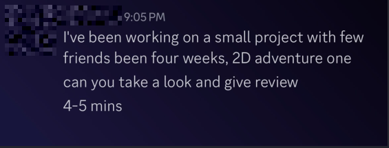

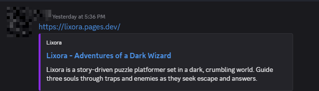

The account was later confirmed to be compromised.

## Investigation Workflow

---

### 1. VirusTotal

The initial detection is 1/95 vendors, so it's likely a new or modified sample:

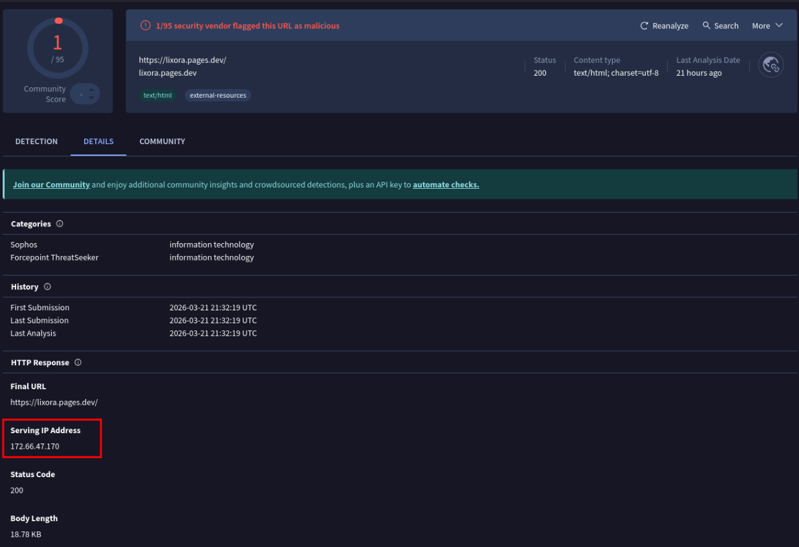

### 2. Infrastructure Pivoting

VirusTotal shows a related executable (bootstrapper) that has communicated with the serving infrastructure:

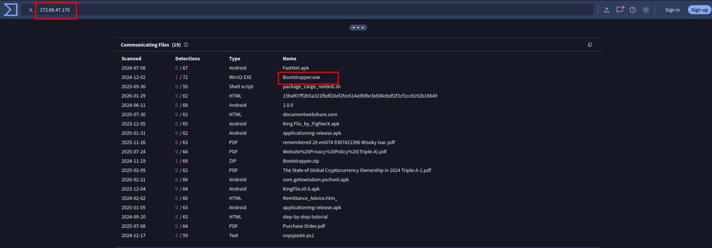

Further inspection of this executable reveals communication with multiple domains, including Discord, as well as references to what appears to be a payload delivery endpoint:

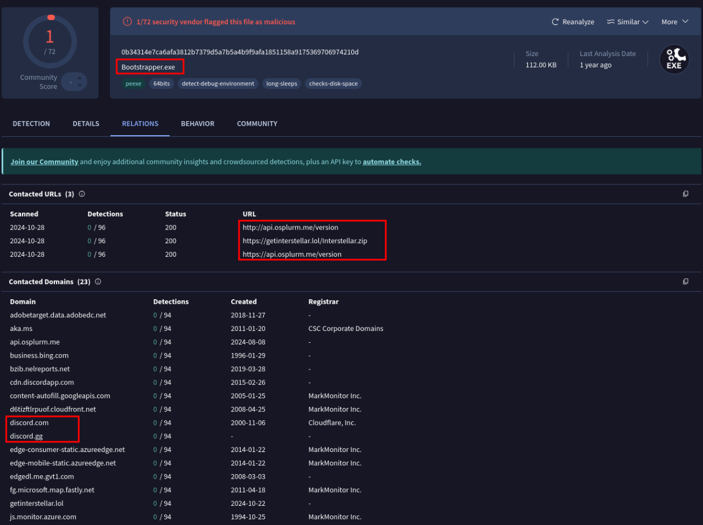

The serving IP itself is also associated with multiple communicating files, reinforcing the likelihood of shared infrastructure:

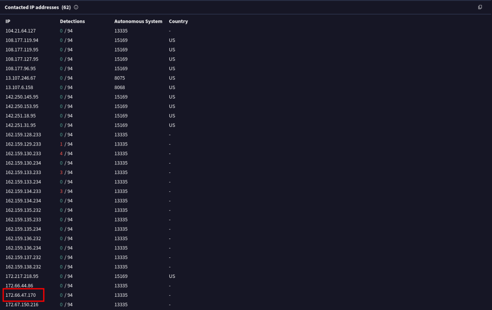

The relationships suggest a multi-stage delivery, where an executable retrieves additional payloads and communicates with external infrastructure.

### 3. Hybrid Analysis

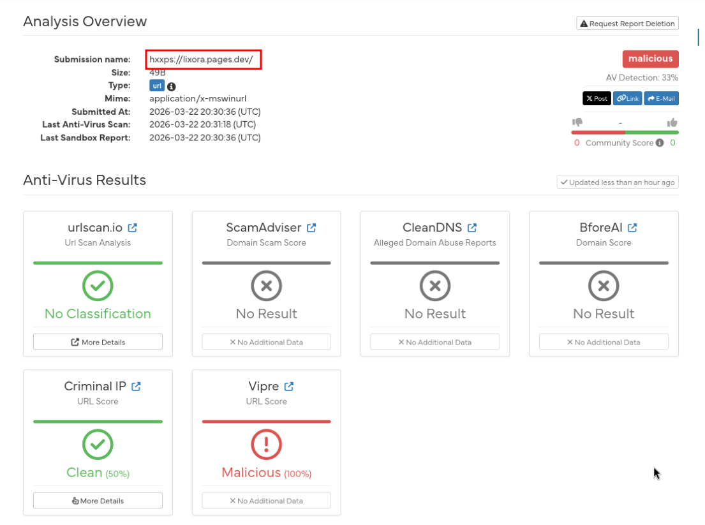

Although the payload was not executed, the sandbox was able to render the landing page used to deliver the malware:

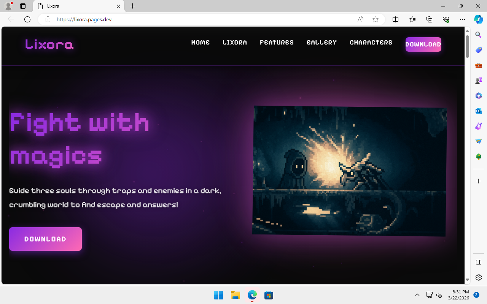

This behavior shows that payload delivery is gated behind user interaction.

At this stage, the presence of a functional delivery page is confirmed but an alternate approach to obtain the payload is required.

### 4. Payload Retrieval

To better understand how the payload was being delivered, the download URL was inspected using a curl command. This revealed that the download link resolves to a direct file hosted on Dropbox.

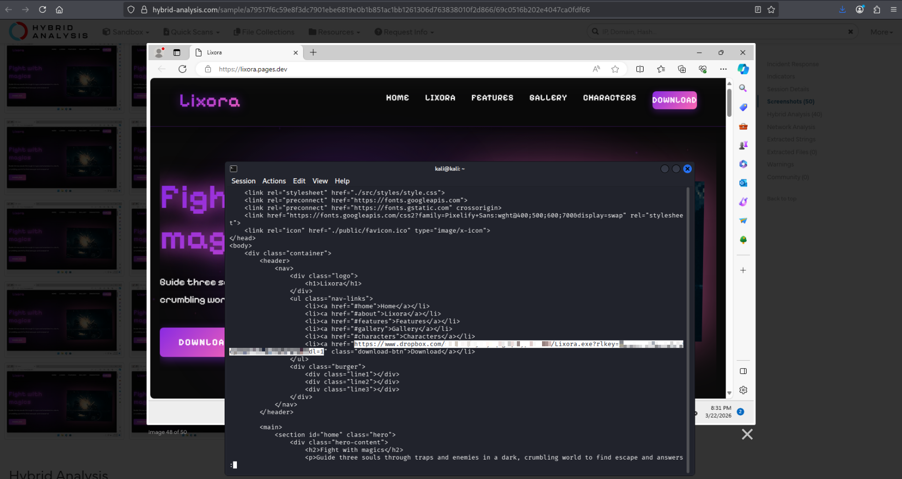

This confirms that the payload is not embedded in the landing page, but instead retrieved from an external file hosting service.

### 5. Dynamic Analysis (Tria.ge)

This stage provided full visibility.

The initial file activity observed after detonation:

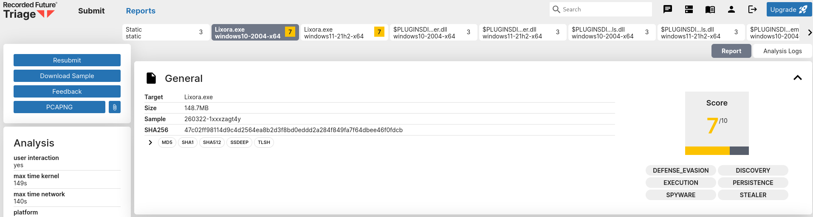

The sandbox highlights several signatures associated with the payload:

- Access to browser user/profile data  
- Interaction with local application data directories  
- Network communication to external infrastructure  

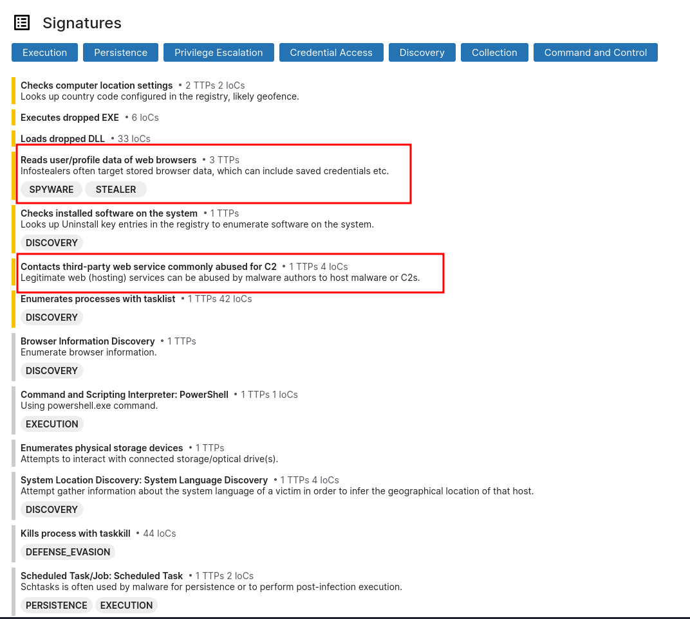

The browser data access is consistent with credential and session theft, which aligns with the Discord account compromises.

Additionally, the payload communicates with external infrastructure, including a third-party web service commonly abused for command-and-control (C2) activity.

## Execution Chain

---

Lixora.exe (NSIS installer)  
- Game Setup Manager.exe (Electron app)  
- PowerShell  
- microsoft.exe -jar service.jar  

At first glance, Lixora presents itself as a simple game. In reality, it is little more than a staged execution chain wrapped in a bad UI.

Aside from the singular Javascript graphic, this is where it becomes clear that Lixora is a lackluster game.

The initial executable acts as a wrapper, unpacking and launching an Electron-based app ("Game Setup Manager.exe"). This component then invokes PowerShell to execute a Java payload using a conveniently named binary: `microsoft.exe`.

You guessed it! It's a renamed Java runtime used to execute `service.jar`, the main payload component.

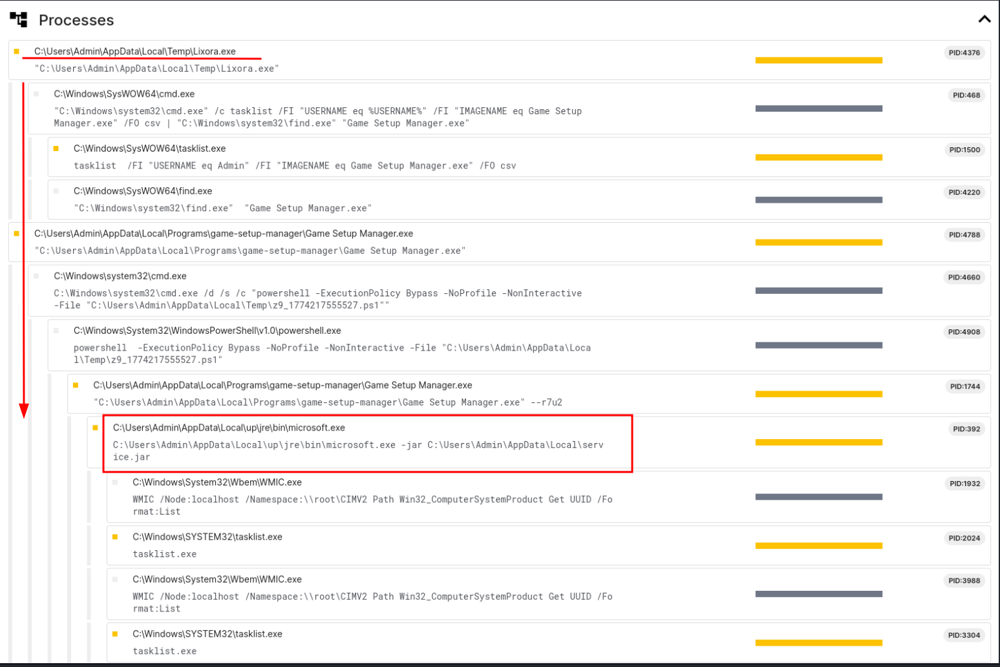

The payload terminates running browser processes prior to execution. This forces users to re-open sessions, and allows the malware access to fresh authentication data and session tokens.

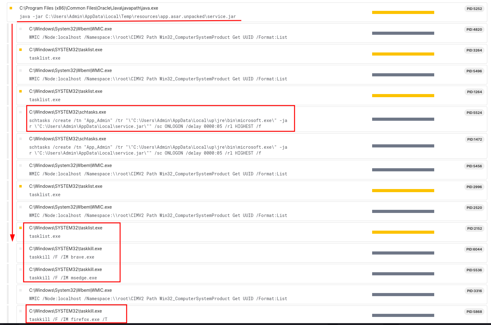

## Command & Control (C2)

---

The payload communicates with both Discord infrastructure and an external domain, `ayhanedition.site`, which is suspected to function as command-and-control (C2) infrastructure.

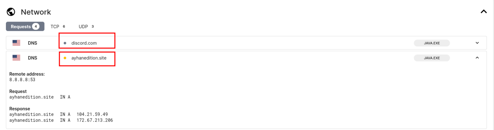

Further analysis of `ayhanedition.site` on VirusTotal shows consistency with previously observed malicious activity.

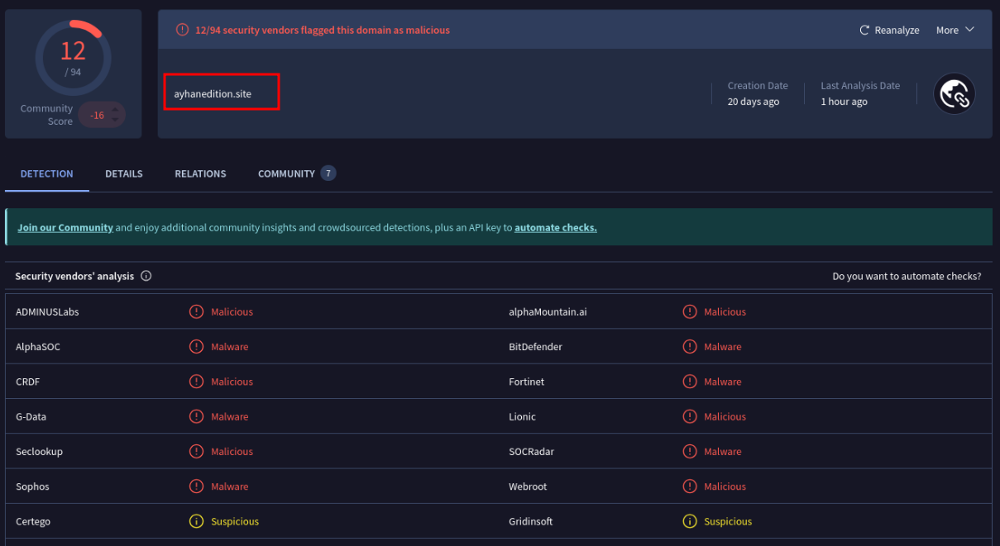

## Infection Flow

---

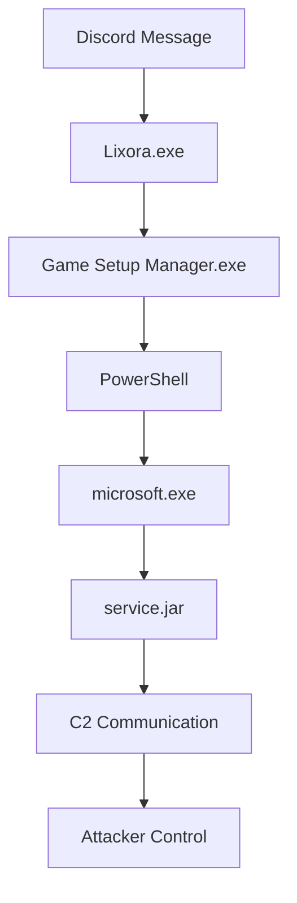

## Indicators of Compromise (IOCs)

---

### File System
- AppData\Local\up\jre\
- Game Setup Manager.exe
- service.jar

### Scheduled Task
- App_Admin

### Network
- ayhanedition.site

## Observed Campaign and Operator Behavior

---

Evidence collected during and after compromise indicates that this campaign extends beyond automated credential theft and includes active operator involvement.

An attempt to access a victim’s email account was observed shortly after Discord account compromise:

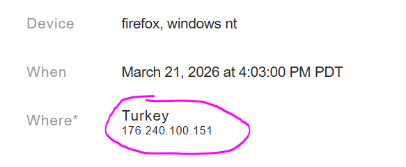

Additionally, victims were contacted and asked to pay for the return of their compromised accounts:

Friends of compromised accounts reported being blocked after responding to the initial lure message in unexpected or non-conforming ways.

This strongly suggests there's a human in the loop.

The original lure message was deleted from conversations after being sent. Perhaps trying to reduce visibility, avoid suspicion, and prolong the effectiveness of the campaign.

It was later observed that compromised accounts have removed/blocked additional friends regardless
of how they responded to the initial lure message.

This further suggests an attempt to reduce visibility or operate under a limited account context.

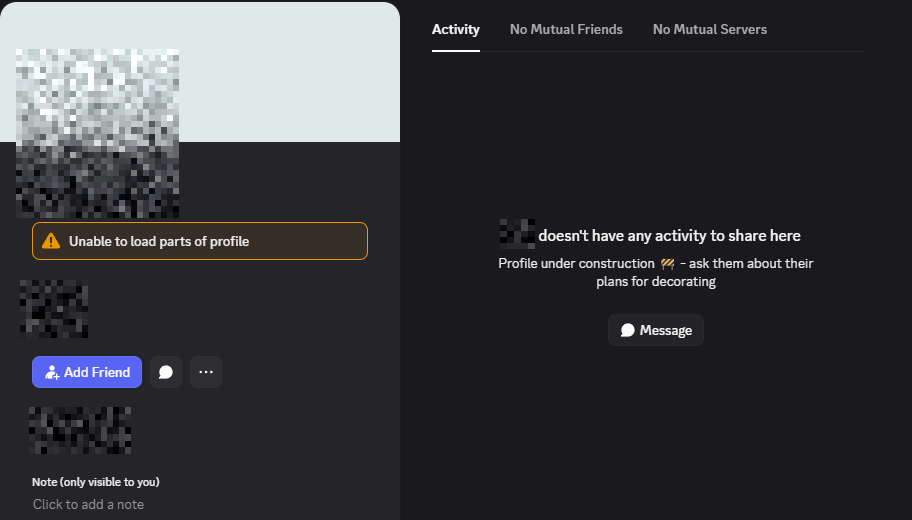
